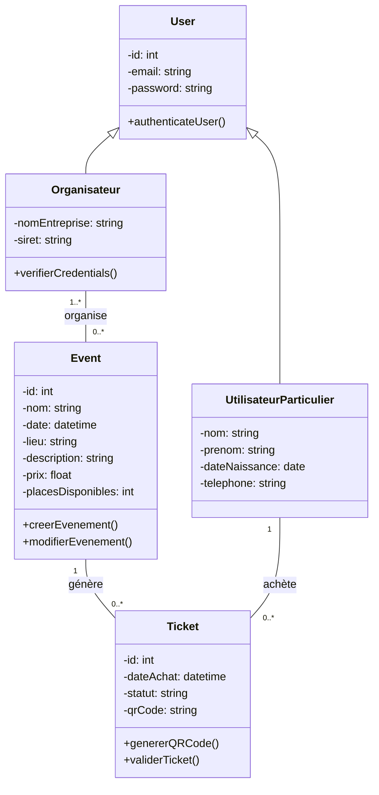

# Rapport de suivi - Projet de réservation de tickets d'événements

## 1. État d'avancement

**Où en sommes-nous ?**  
_Jusqu'à présent, nous avons créé toutes les entités nécessaires 
à notre conception et fais les classes DAO de ces dernières.
Nous avons aussi écrit quelques classes de services pour gérer les entités._
Nous avons défini les entités, les services et les contrôleurs 
nécessaires pour gérer les réservations. 
Nous avons également mis en place une base de données MySQL pour stocker les données._

## 2. Fonctionnalités testées et en cours

### Fonctionnalités qui marchent :
1. **Gestion des évènements :**
   - [X] _Création d'un évènement_
   - [X] _Récupération de tous les évènements_
   - [X] _Récupération d'un évènement par l'id de son organisateur_
   - [X] _Récupération d'un évènement par son id_
   - [X] _Modification d'un évènement par son id_
   - [X] _Suppression d'un évènement par son id_

2. **Gestion des tickets :**
   - [X] _Création des tickets lors de la création d'un évènement_


### Fonctionnalités en cours de développement ou à améliorer :
-  _Gestion des évènements_
-  _Gestion des tickets_
### Fonctionnalités à implémenter :
   _Gestion des réservations et des utilisateurs._
   _Ajout de OpenAPI pour la documentation de l'API REST._

## 3. Instructions pour démarrer le projet

### Prérequis
- Java 17+
- Maven
- MySQL
- Postman ou cURL pour tester les endpoints

### Installation et exécution
1. **Cloner le dépôt :**
   ```sh
   git clone https://github.com/Yann2808/tp2_sir2024.git
   cd tp2_sir2024
   ```
2. **Configurer la base de données :**
    - Modifier le fichier `persistence.xml` pour renseigner les paramètres de connexion.
    - Lancer le script sh `run-hsqldb-server.sh` pour initialiser la base de données et lancer `show-hsqldb.sh` pour voir la base de données.

3. **Démarrer l'application :**
   ```sh
   mvn clean install
   mvn jetty:run
   ```
4. **Accéder à l'API :**
    - API REST : `http://localhost:8111/`
    - Documentation OpenAPI : `http://localhost:8111/api-docs`

## 4. Prochaines étapes
_Les prochaines étapes consisteront à implémenter les fonctionnalités de création et de gestion des utilisateurs, des tichets.
Nous allons également ajouter la documentation OpenAPI pour l'API REST._

## 5. Informations sur l'équipe
- **Monôme :** Augustin Sèmèvo SALAKO
- **Encadrant de TP :** Adrien Le Roch
- **URL du repo Git :** https://github.com/Yann2808/tp2_sir2024.git

## 6. Diagramme de classes
_Le diagramme de classes ci-dessous représente les entités de notre application et les relations entre elles._

